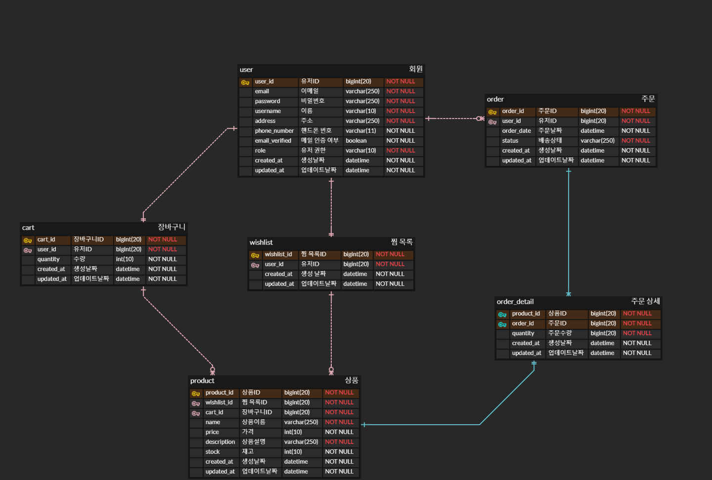

# 대규모 예약 구매 요청을 처리하는 e-커머스 플랫폼

## 1. 프로젝트 소개

이 프로젝트는 대규모 예약 구매 요청을 효율적으로 처리하는 e-커머스 플랫폼. 불특정 다수의 고객이 특정 제품을 대량으로 예약 구매할 수 있도록 지원하며, 이를 통해 공급망 관리와 재고 최적화를 극대화합니다.

### 주요 기능
- **예약 구매 시스템**: 고객이 원하는 제품을 미리 예약하고 지정된 날짜에 대량 구매할 수 있도록 지원.
- **실시간 재고 관리**: 예약된 주문에 맞춰 실시간으로 재고를 관리하여 효율적인 공급망 운영.
- **알림 및 업데이트**: 예약 구매 진행 상황을 실시간으로 고객에게 알림.

## 2. 프로젝트 아키텍처 구조

본 프로젝트는 MSA(Microservices Architecture)를 채택하여 다음과 같은 구성 요소들로 이루어져 있습니다:

### (1) 주요 기술 스택
- **Backend**: Spring Boot, Spring Data JPA, Spring Security
- **Database**: MySQL, Redis
- **Microservices Architecture**: Eureka, Spring Cloud Gateway, Circuit Breaker
- **Containerization**: Docker
- **Testing**: Apache JMeter

### (2) 서비스 구성
1. **Eureka (Service Discovery)**
    - 모든 마이크로서비스가 Eureka 서버에 자신을 등록하여 동적 서비스 디스커버리 및 로드 밸런싱을 구현.

2. **Spring Cloud Gateway (API Gateway)**
    - 클라이언트 요청을 적절한 마이크로서비스로 라우팅하는 API 게이트웨이 역할.

3. **Circuit Breaker (회복 탄력성)**
    - 각 마이크로서비스 간의 통신 장애 발생 시 서비스의 연쇄적 실패를 방지하기 위해 Circuit Breaker 패턴을 적용.

4. **Redis 및 MySQL**
    - **MySQL**: 주요 데이터 저장을 위한 관계형 데이터베이스.
    - **Redis**: 빠른 데이터 접근을 위한 캐싱 시스템.

5. **Docker**
    - 각 마이크로서비스를 컨테이너화하여 일관된 개발 환경 제공 및 배포 자동화.

### (3) 아키텍처 다이어그램
#### ERD

#### 아키텍처
- 아키텍처 이미지 제작 후 업로드 예정

## 3. 트러블 슈팅

### (1) Redis와 MySQL 간의 데이터 불일치 문제 해결
#### 문제 상황
동시 다발적인 재고 조회 및 업데이트 시 Redis 캐시와 MySQL 데이터베이스 간의 데이터 불일치 문제가 발생.

#### 해결 방법
Redis의 분산 락 기능을 사용하여 데이터 일관성 문제를 해결.
- **분산 락 적용**: 재고 조회 및 업데이트 시 Redis의 `SETNX` 명령어를 사용하여 분산 락을 구현. 이는 동일한 자원에 대해 동시에 여러 쓰레드가 접근하지 못하도록 보장.
- **락 획득 후 작업 수행**: 분산 락을 획득한 경우에만 Redis와 MySQL에서 재고 데이터를 일관성 있게 조회 및 업데이트.
- **락 해제**: 작업이 완료되면 락을 해제하여 다른 쓰레드가 재고 데이터를 업데이트할 수 있도록 함.

### (2) Redis 캐싱 전략으로 Write-through 전략 수립

#### 문제 상황
기존에 Write-back으로 진행하던 방식에서 만일 캐시에 장애가 발생했을 경우 데이터가 영구 소실될 수 있다는 단점이 발생.

##### 해결 방법
- **Write through 전략으로 변경**: 비록 캐시와 영속성 DB 두 단계를 거쳐서 저장하기 때문에 상대적으로 느리다는 단점이 있지만, 캐시의 데이터를 항상 최신 데이터로 유지하고 영속성 DB와의 데이터와도 일치하기 떄문에 데이터 유실이 발생하면 안되는 상황에 적절하다고 판단.
#### 테스트툴 이미지 캡쳐 후 첨부할 예정

## 4. 기간
### 2024.04.17 ~ 진행 중